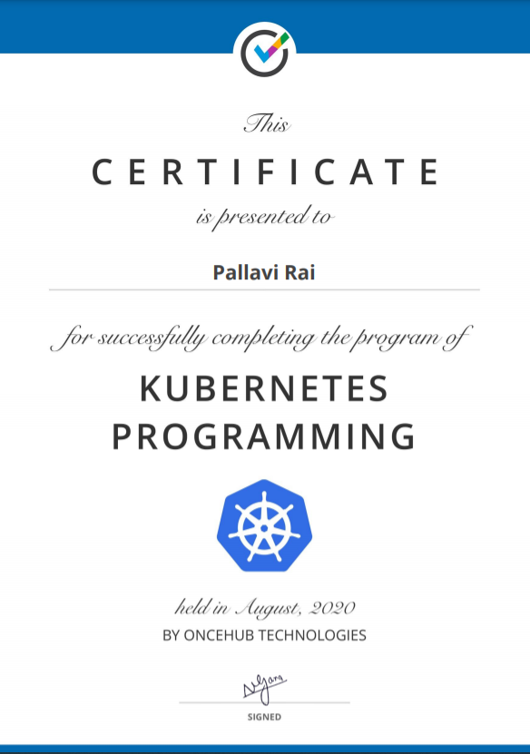
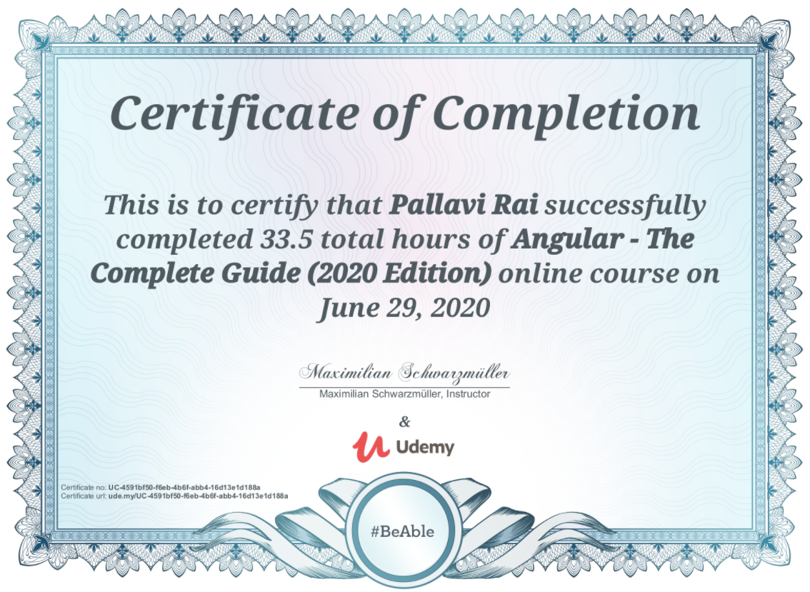
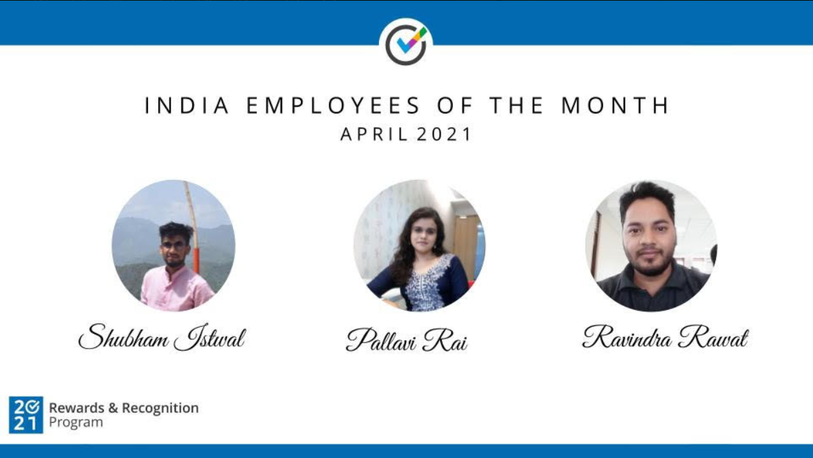
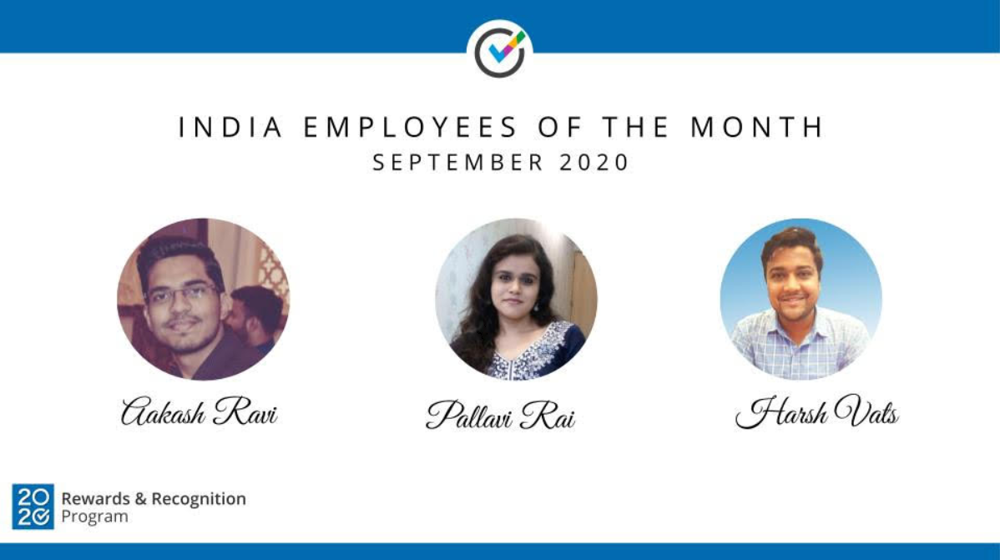
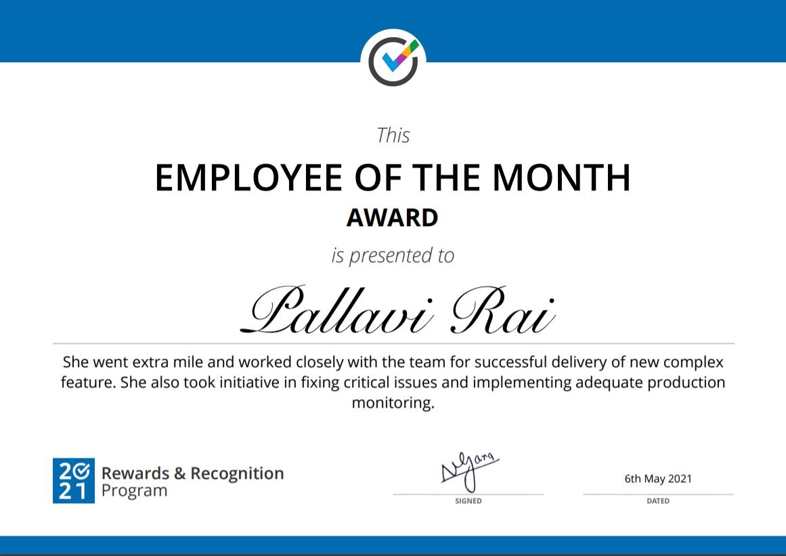
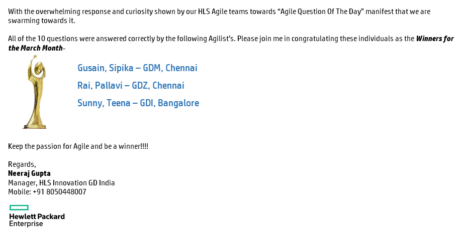
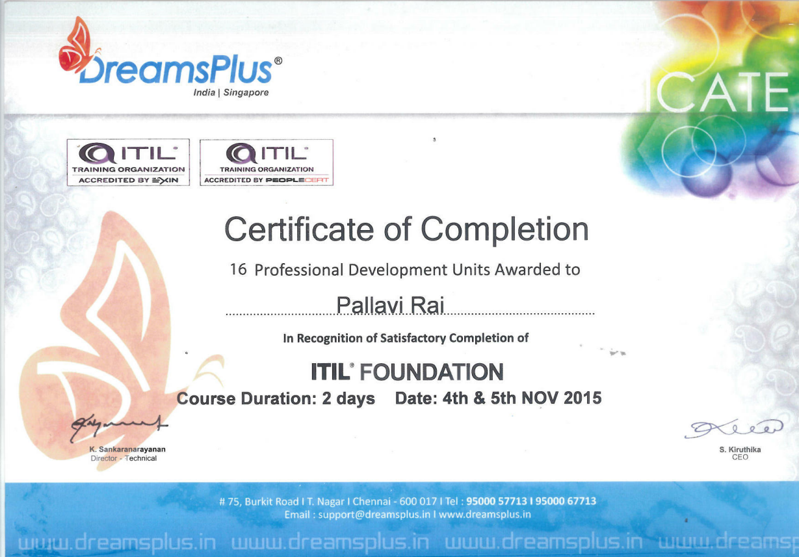

<h1 align="center"> Hey There !!  I'm Pallavi</h1>

 Thank you for visiting my profile!! 

---

 I am a full stack developer having 5+ years of experience as a polyglot programmer with end to end software delivery which includes, development from scratch to deployment. 

  

---

<h2> I like to code in </h2>

                                                                              

---

<h2> My certifications and awards </h2>

---

<h2> GitHub Stats </h2>

  

 

&nbsp;

---

<h2> Do you like to chat with me? </h2>

 

